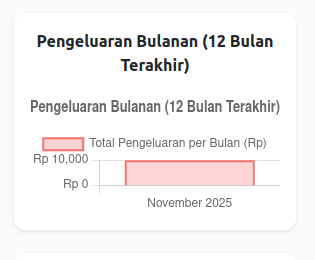
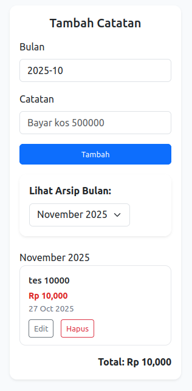

<p align="center">
  
</p>

<h1 align="center">💰 Aplikasi Budgeting Pengeluaran Keluarga</h1>

<p align="center">
  <b>Aplikasi open source sederhana untuk mencatat, memantau, dan mengelola pengeluaran keluarga berbasis Laravel + SQLite.</b>
</p>

<p align="center">
  <a href="https://github.com/laravel/framework/actions"></a>
  <a href="https://packagist.org/packages/laravel/framework"></a>
  <a href="https://opensource.org/licenses/MIT"></a>
</p>

---

## 📸 Tampilan Aplikasi (Coming Soon)

> Gambar tampilan dashboard dan fitur utama akan segera ditambahkan di sini.
>
> Contoh:
>
> -   📊 Dashboard keuangan keluarga
> -   🧾 Daftar pengeluaran harian
> -   💵 Ringkasan per kategori (makanan, transportasi, pendidikan, dll.)
> -   📅 Filter berdasarkan bulan

---

## ✨ Fitur Utama

✅ Catat pengeluaran keluarga dengan mudah  
✅ Kelompokkan pengeluaran berdasarkan kategori  
✅ Lihat total pengeluaran per bulan  
✅ Gunakan **SQLite** (tanpa setup database tambahan)  
✅ UI sederhana dan ringan untuk digunakan di laptop atau HP

---

## 📸 Tampilan Aplikasi

### 🏠 Dashboard Utama

[Dashboard](screenshot/Screenshot from 2025-10-27 23-57-12.png)


### 💵 Grafik Bulanan Pengeluaran



### 💵 Formn Pengeluaran



---

## ⚙️ Teknologi yang Digunakan

-   **Laravel 11**
-   **PHP 8.2+**
-   **SQLite Database**
-   **Bootstrap 5 / Tailwind (opsional)**
-   **Blade Template Engine**

---

## 🚀 Instalasi

Ikuti langkah-langkah berikut untuk menjalankan proyek ini di lokal:

### 1️⃣ Clone Repository

```bash
git clone https://github.com/luqni/budget-app.git
cd budget-app
```

### 2️⃣ Install Dependencies

Pastikan kamu sudah menginstal Composer

```bash
composer install
```

### 3️⃣ Copy File Environment

```bash
cp .env.example .env
```

### 4️⃣ Generate App Key

```bash
php artisan key:generate
```

### 5️⃣ Gunakan SQLite sebagai Database

Buka file .env, lalu ubah konfigurasi database menjadi seperti berikut:

```bash
DB_CONNECTION=sqlite
DB_DATABASE=database/database.sqlite
```

Jika folder database/ belum ada file database.sqlite, buat file kosong:

```bash
touch database/database.sqlite
```

### 6️⃣ Jalankan Migrasi

```bash
php artisan migrate
```

### 7️⃣ Jalankan Aplikasi

```bash
php artisan serve
```

### 🔒 Lisensi

Proyek ini menggunakan lisensi MIT License

### 💡 Rencana Pengembangan Selanjutnya

📱 Mode mobile-friendly (PWA)

📊 Grafik pengeluaran per kategori

👨‍👩‍👧 Multi user (setiap anggota keluarga bisa login)

💬 Fitur pengingat budgeting bulanan

### 💬 Dukungan

Jika kamu menyukai proyek ini, bantu dengan ⭐️ memberi star di GitHub.
Atau jika ingin berdiskusi, buka Issues untuk memberikan ide atau melaporkan bug.

<p align="center">Dibuat dengan ❤️ menggunakan Laravel oleh <b>Muhammad Luqni Baehaqi</b></p> ```
